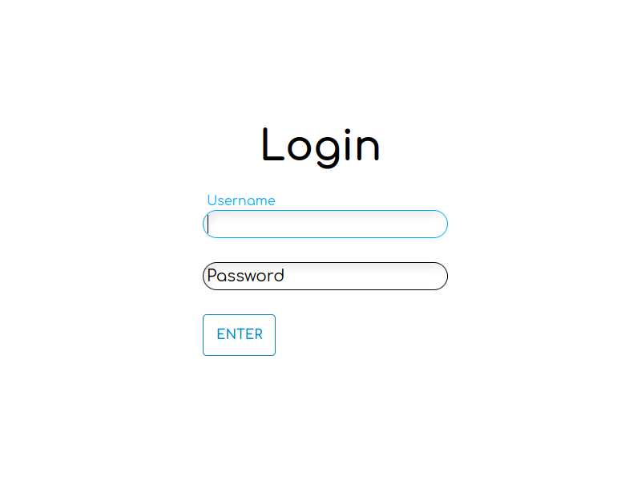

# login-php-app
Simple login system app made with php 7 and mariadb 10.4, but works in newer versions too. It doesn't use any frameworks. In the index page I used a UI preset from another project, you can see this project [here](https://github.com/Firespindash/index-html-ui-preset).

## Usability
You can navigate with Enter key on login and signup pages. \
This simple web app has options to login, logout, create and delete user, and a it has a simple content section.

## Set Up
I made this app with php server using the command `php -S localhost:9090` at terminal. \
You have to make the database using the **login-php-app.sql**. The database already has a user named 'admin' with the password 'test1'. To setup it up, you will need to do the basics, create an user in mysql called 'admin' with the password 'teste1', unless you change these in the **connection-manager.php** file. And beforehand, create a database called 'users', and grant permissions for the user only on this database, as it is a good practice. And dump the **login-php-app.sql** file on it. If you are unsure on how to do it, you can see this [wiki](https://github.com/Firespindash/login-php-app/wiki/Setting-Up-for-Tests) with the necessary commands. Passwords are stored in the database with md5.